# Hi there, I'm Rendi Adinata

I'm a mathematics undergraduate student.

### What I'm working on
* My undergrad thesis 😃
### 🛠️ Technologies & Tools
* **Languages:**  Python, C++
* **Math/Animation:** Typst, LaTeX

### GitHub Stats

   
 

---
